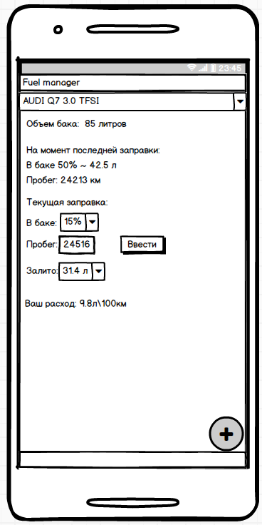
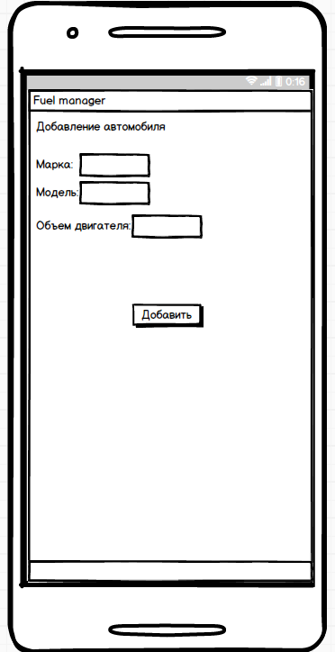

# Требования к проекту
---

# Содержание
1 [Введение](#intro)  
1.1 [Назначение](#appointment)  
1.2 [Бизнес-требования](#business_requirements)  
1.2.1 [Исходные данные](#initial_data)  
1.3 [Аналоги](#analogues)  
2 [Требования пользователя](#user_requirements)  
2.1 [Программные интерфейсы](#software_interfaces)  
2.2 [Интерфейс пользователя](#user_interface)  

<a name="intro"/>

# 1 Введение

<a name="appointment"/>

## 1.1 Назначение
В этом документе описаны функциональные и нефункциональные требования к приложению «Fuel manager» для ОС Android. Этот документ 
предназначен для команды, которая будет реализовывать и проверять корректность работы приложения. 

<a name="business_requirements"/>

## 1.2 Бизнес-требования

<a name="initial_data"/>

### 1.2.1 Исходные данные
Большинство людей владеющие автомобилем хотят как можно больше уменьшить расходы на топливо.Однако, не каждый человек готов 
тратить время на запись данных и расчет расходуемого топлива, поэтому получение данных такими способами сопряжено с потерей
времени.  В связи с этим многие из представителей владельцев автомобилей начинают использовать компьютеры или мобильные 
устройства дляполучения точного расхода топлива.Большинсво из автовладельцев старшей возрастной категории не обладает достаточной технической грамотностью для использования приложений, рассчитанных на продвинутых пользователей. Дополнительные трудности возникают из-за того,что эти приложения зачастую не рассчитаны на использование людьми с плохим зрением. Это приводит к тому, что многие возвращаются к привычным способам получения информации.

<a name="business_opportunities"/>

### 1.2.2 Возможности бизнеса
Многие люди имеющие автомобиль желают иметь приложение, которое позволит получать актуальный расход топлива, обладая
минимальой технической грамотностью. Подобное приложение позволит им тратить меньше времени на расчет необходимой информации. 
Интерфейс, спроектированный с учётом всех особенностей для данного типа людей, и дополнение приложения подробной инструкцией
позволят увеличить количество людей, использующих данное приложение.

<a name="project_boundary"/>

### 1.2.3 Границы проекта
Приложение «Fuel manager» позволит пользователям просматривать информацию о расходе топлива с момента прошлой заправки. Для автовладельцев с несколькими автомобилями предусмотрена возможность добавления нескольких автомобилей.

<a name="analogues"/>

## 1.3 Аналоги
Обзор аналогов представлен в документе [Overview of analogues](../Requirements/Overview%20of%20analogues.md).

<a name="user_requirements"/>

# 2 Требования пользователя

<a name="software_interfaces"/>

## 2.1 Программные интерфейсы
Приложение обрабатывает данные введенные пользователем после заправки автомобиля.

<a name="user_interface"/>

## 2.2 Интерфейс пользователя
Окно входа в приложение, когда автомобиль уже добавлен.

 

Окно добавления автомобиля.

 

