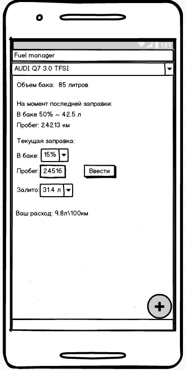

# Требования к проекту
---

# Содержание
1 [Введение](#intro)  
1.1 [Назначение](#appointment)  
1.2 [Бизнес-требования](#business_requirements)  
1.2.1 [Исходные данные](#initial_data)  
1.3 [Аналоги](#analogues)  
2 [Требования пользователя](#user_requirements)  
2.1 [Программные интерфейсы](#software_interfaces)  
2.2 [Интерфейс пользователя](#user_interface)  
2.3 [Характеристики пользователей](#user_specifications)  
2.3.1 [Классы пользователей](#user_classes)  
2.3.2 [Аудитория приложения](#application_audience)  
2.3.2.1 [Целевая аудитория](#target_audience)  
2.3.2.1 [Побочная аудитория](#collateral_audience)  
3 [Системные требования](#system_requirements) 
3.1 [Нефункциональные требования](#non-functional_requirements)  
3.1.1 [Атрибуты качества](#non-functional_requirements)  
3.1.1.1 [Требования к удобству использования](#requirements_for_ease_of_use) 
3.1.1.2 [Требования к безопасности](#security_requirements) 
3.1.2 [Внешние интерфейсы](#security_requirements) 
3.2 [Функциональные требования](#functional_requirements) 
3.2.1 [Основные функции](#main_functions) 
3.2.1.1 [Вход пользователя в приложение](#user_logon_to_the_application) 
3.2.1.2 [Настройка профиля активного пользователя](#setting_up_the_profile_of_the_active_user) 
3.2.1.3 [Загрузка данных](#download_data) 
3.2.1.4 [Добавление нового автомобиля](#add_new_car) 

<a name="intro"/>

# 1 Введение

<a name="appointment"/>

## 1.1 Назначение
В этом документе описаны функциональные и нефункциональные требования к приложению «Fuel manager» для ОС Android. Этот документ 
предназначен для команды, которая будет реализовывать и проверять корректность работы приложения. 

<a name="business_requirements"/>

## 1.2 Бизнес-требования

<a name="initial_data"/>

### 1.2.1 Исходные данные
Большинство людей владеющие автомобилем хотят как можно больше уменьшить расходы на топливо.Однако, не каждый человек готов 
тратить время на запись данных и расчет расходуемого топлива, поэтому получение данных такими способами сопряжено с потерей
времени.  В связи с этим многие из представителей владельцев автомобилей начинают использовать компьютеры или мобильные 
устройства дляполучения точного расхода топлива.Большинсво из автовладельцев старшей возрастной категории не обладает достаточной технической грамотностью для использования приложений, рассчитанных на продвинутых пользователей. Дополнительные трудности возникают из-за того,что эти приложения зачастую не рассчитаны на использование людьми с плохим зрением. Это приводит к тому, что многие возвращаются к привычным способам получения информации.

<a name="business_opportunities"/>

### 1.2.2 Возможности бизнеса
Многие люди имеющие автомобиль желают иметь приложение, которое позволит получать актуальный расход топлива, обладая
минимальой технической грамотностью. Подобное приложение позволит им тратить меньше времени на расчет необходимой информации. 
Интерфейс, спроектированный с учётом всех особенностей для данного типа людей, и дополнение приложения подробной инструкцией
позволят увеличить количество людей, использующих данное приложение.

<a name="project_boundary"/>

### 1.2.3 Границы проекта
Приложение «Fuel manager» позволит пользователям просматривать информацию о расходе топлива с момента прошлой заправки. Для автовладельцев с несколькими автомобилями предусмотрена возможность добавления нескольких автомобилей.

<a name="analogues"/>

## 1.3 Аналоги
Обзор аналогов представлен в документе [Overview of analogues](../Requirements/Overview%20of%20analogues.md).

<a name="user_requirements"/>

# 2 Требования пользователя

<a name="software_interfaces"/>

## 2.1 Программные интерфейсы
Приложение обрабатывает данные введенные пользователем после заправки автомобиля.

<a name="user_interface"/>

## 2.2 Интерфейс пользователя
Окно входа в приложение, когда автомобиль уже добавлен.

 

Окно добавления автомобиля.

 

<a name="user_specifications"/>

## 2.3 Характеристики пользователей

<a name="user_classes"/>

### 2.3.1 Классы пользователей

| Класс пользователей | Описание |
|:---|:---|
|Владелец автомобиля| Пользователь, который хочет контролировать расход. Имеет доступ к полному функционалу. |

<a name="application_audience"/>

### 2.3.2 Аудитория приложения

<a name="target_audience"/>

#### 2.3.2.1 Целевая аудитория
Люди старшей возрастной категории со средним или выше среднего уровнем образования, обладающие минимальной технической грамотностью.

<a name="collateral_audience"/>

#### 2.3.2.2 Побочная аудитория
Люди средней возрастной категории, обладающие вышеперечисленными качествами.

<a name="system_requirements"/>

# 3 Системные требования

<a name="non-functional_requirements"/>

## 3.1 Нефункциональные требования

<a name="quality_attributes"/>

### 3.1.1 Атрибуты качества

<a name="requirements_for_ease_of_use"/>

#### 3.1.1.1 Требования к удобству использования
1. Доступ к основным функциям приложения не более чем за две операции;
2. Все функциональные элементы пользовательского интерфейса имеют названия, описывающие действие, которое произойдет при выборе элемента;
3. Пошаговая инструкция использования основных функций приложения отображена в справке;

<a name="security_requirements"/>

#### 3.1.1.2 Требования к безопасности
Приложение предоставляет возможность просмотра и редактирования профиля только активного пользователя.

<a name="external_interfaces"/>

### 3.1.2 Внешние интерфейсы
Окна приложения удобны для использования пользователями с плохим зрением:
  * размер шрифта не менее 14пт;
  * функциональные элементы контрастны фону окна.
  
<a name="functional_requirements"/>

## 3.2 Функциональные требования

<a name="main_functions"/>

### 3.2.1 Основные функции

<a name="user_logon_to_the_application"/>

#### 3.2.1.1 Вход пользователя в приложение
**Описание.** Пользователь имеет возможность использовать приложение без создания собственного профиля.

| Функция | Требования | 
|:---|:---|
| Вход в приложение без создания собственного профиля | Приложение должно предоставить пользователю полный функционал приложения|

<a name="setting_up_the_profile_of_the_active_user"/>

#### 3.2.1.2 Настройка профиля активного пользователя
**Описание.** Пользователь имеет возможность редактировать список автомбилей, с которых производится сбор данных для расчета расхода.
 
| Функция | Требования | 
|:---|:---|
| Добавление автомобилей | Приложение должно предоставить пользователю поле для ввода марки\модели автомобиля. Пользователь должен либо ввести данные и подвердить действие, либо отменить его |
| Удаление автомобилей |Пользователь имеет возможножность выделить автомобиль и удалить его |

<a name="download_data"/>

#### 3.2.1.3 Загрузка данных
**Описание.** После входа пользователя в приложение необходимо загрузить информацию о расходе выбранного автомобиля.

| Функция | Требования | 
|:---|:---|
| Загрузка информации о расходе| Приложение должно загрузить информацию о расходе после входа пользователя в приложение |

<a name="add_new_car"/>

#### 3.2.1.4 Добавление нового автомобиля
**Описание.** Пользователь имеет возможность добавить новый автомобиль.

**Требование.** Приложение должно предоставить пользователю возможность добавления автомобиля. 
