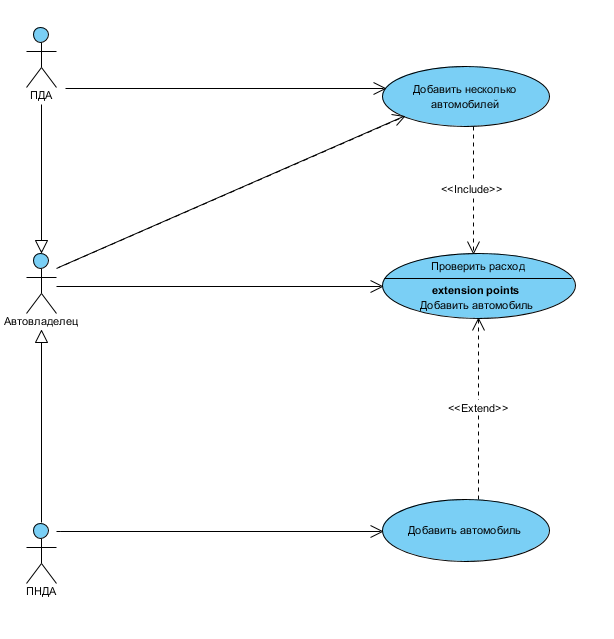

# Диаграмма вариантов использования

 
Ключевые понятия, используемые в диаграмме вариантов использования, отражены в [глоссарии](../UseCase/Glossarium.md). 
Сценарии для каждого варианта использования описаны в [потоке событий](../UseCase/FlowOfevents.md).
